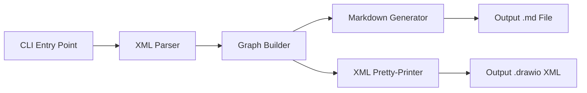

# Design Document: drawio-to-markdown

## Overview

This tool is a .NET 10 console application that converts draw.io XML diagram files into Markdown documentation of activity dependencies. It parses mxGraph XML, builds an internal directed graph of activity dependencies, and renders that graph as a structured Markdown document.

The architecture follows a pipeline pattern: **Parse → Build Graph → Generate Output**. A secondary pretty-printer path enables round-trip testing by converting the internal graph back to draw.io-compatible XML.

### Key Design Decisions

| Decision | Rationale |
|----------|-----------|
| `System.Xml.Linq` (LINQ to XML) for parsing | Built-in, no external dependency needed for XML parsing |
| `System.CommandLine` for CLI | Official Microsoft library for .NET CLI apps, handles parsing, help, and validation |
| Immutable record types for domain models | Thread-safe, testable, value-equality semantics for round-trip verification |
| Pipeline architecture | Clear separation of concerns, each stage is independently testable |
| No external graph library | The dependency graph is simple (adjacency list); a library would be overkill |

## Architecture



### Pipeline Stages

1. **CLI** — Parses command-line arguments, validates file paths, orchestrates the pipeline
2. **XML Parser** — Reads draw.io XML, extracts raw mxCell elements into intermediate representations
3. **Graph Builder** — Constructs a `DependencyGraph` from parsed cells, handling deduplication and dangling edge filtering
4. **Markdown Generator** — Transforms the graph into formatted Markdown text
5. **XML Pretty-Printer** — Transforms the graph back into draw.io-compatible XML (for round-trip testing)

## Components and Interfaces

### Project Structure

```
src/DrawioToMarkdown/
├── DrawioToMarkdown.csproj
├── Program.cs                      # Entry point, CLI configuration
├── Parsing/
│   ├── DrawioParser.cs             # XML → ParsedDiagram
│   └── ParsedDiagram.cs            # Intermediate representation
├── Graph/
│   ├── DependencyGraph.cs          # Core domain model
│   ├── GraphBuilder.cs             # ParsedDiagram → DependencyGraph
│   └── ActivityNode.cs             # Node record
├── Output/
│   ├── MarkdownGenerator.cs        # DependencyGraph → Markdown string
│   └── XmlPrettyPrinter.cs         # DependencyGraph → XML string
└── Cli/
    └── CliConfiguration.cs         # System.CommandLine setup
```

### Interface Definitions

```csharp
/// Parses draw.io XML content into an intermediate representation.
public interface IDrawioParser
{
    ParsedDiagram Parse(string xmlContent);
}

/// Builds a DependencyGraph from a parsed diagram.
public interface IGraphBuilder
{
    DependencyGraph Build(ParsedDiagram diagram);
}

/// Generates Markdown from a DependencyGraph.
public interface IMarkdownGenerator
{
    string Generate(DependencyGraph graph);
}

/// Converts a DependencyGraph back to draw.io-compatible XML.
public interface IXmlPrettyPrinter
{
    string Print(DependencyGraph graph);
}
```

### Component Responsibilities

**DrawioParser**
- Loads XML using `XDocument.Parse()`
- Finds all `mxCell` elements
- Classifies each as vertex (node) or edge based on attributes
- Returns a `ParsedDiagram` containing raw node/edge data

**GraphBuilder**
- Takes `ParsedDiagram` and constructs `DependencyGraph`
- Filters out edges where source or target ID doesn't match any known node
- Deduplicates edges (same source→target pair counted once)
- Populates each node's list of antecedents

**MarkdownGenerator**
- Iterates nodes in the graph (sorted alphabetically by label)
- Emits `# Dependency Documentation` heading
- For each node: `## {label}` heading, then `### Depends on` with bullet list or "No dependencies" text

**XmlPrettyPrinter**
- Reconstructs mxGraphModel/root structure
- Emits mxCell id="0" and mxCell id="1" parent="0" (standard draw.io root cells)
- Emits each node as a vertex mxCell with its label as the `value` attribute
- Emits each edge as an edge mxCell with `source` and `target` attributes

## Data Models

```csharp
/// A single activity node extracted from the diagram.
public sealed record ActivityNode(string Id, string Label);

/// A directed edge representing a dependency relationship.
/// Source is the antecedent (prerequisite), Target is the dependent.
public sealed record DependencyEdge(string SourceId, string TargetId);

/// Intermediate representation of raw parsed XML data.
public sealed record ParsedDiagram(
    IReadOnlyList<ActivityNode> Nodes,
    IReadOnlyList<DependencyEdge> Edges
);

/// The validated dependency graph with resolved relationships.
public sealed class DependencyGraph
{
    /// All activity nodes in the graph, keyed by ID.
    public IReadOnlyDictionary<string, ActivityNode> Nodes { get; }

    /// For each node ID, the set of antecedent (prerequisite) node IDs.
    public IReadOnlyDictionary<string, IReadOnlySet<string>> Dependencies { get; }

    public DependencyGraph(
        IReadOnlyDictionary<string, ActivityNode> nodes,
        IReadOnlyDictionary<string, IReadOnlySet<string>> dependencies)
    {
        Nodes = nodes;
        Dependencies = dependencies;
    }
}
```

### Draw.io XML Structure (Reference)

A typical draw.io file has this structure:

```xml
<mxfile>
  <diagram name="Page-1">
    <mxGraphModel>
      <root>
        <mxCell id="0" />
        <mxCell id="1" parent="0" />
        <!-- Vertex (activity node) -->
        <mxCell id="2" value="Design API" vertex="1" parent="1" />
        <!-- Edge (dependency arrow) -->
        <mxCell id="5" edge="1" source="2" target="3" parent="1" />
      </root>
    </mxGraphModel>
  </diagram>
</mxfile>
```

The parser navigates through `mxfile/diagram/mxGraphModel/root` to find `mxCell` elements.

## Correctness Properties

*A property is a characteristic or behavior that should hold true across all valid executions of a system — essentially, a formal statement about what the system should do. Properties serve as the bridge between human-readable specifications and machine-verifiable correctness guarantees.*

### Property 1: Parse/Print Round-Trip

*For any* valid `DependencyGraph` (containing nodes with unique IDs and non-empty labels, and edges referencing only existing node IDs), pretty-printing the graph to draw.io XML and then parsing that XML back into a `DependencyGraph` SHALL produce a graph equivalent to the original (same nodes with same IDs and labels, same dependency relationships).

**Validates: Requirements 1.1, 1.2, 1.3, 2.1, 2.2, 5.1, 5.2**

### Property 2: Dangling Edge Filtering

*For any* `ParsedDiagram` containing nodes and edges (where some edges reference source or target IDs that do not correspond to any node in the diagram), building the `DependencyGraph` SHALL include only those edges where both source and target IDs correspond to existing nodes, and all valid edges SHALL still be present.

**Validates: Requirements 2.3**

### Property 3: Edge Deduplication (Idempotence)

*For any* `ParsedDiagram` containing duplicate edges (multiple edges with the same source and target), the resulting `DependencyGraph` SHALL contain exactly one dependency relationship between those nodes. Equivalently: adding duplicate edges to the input does not change the resulting graph.

**Validates: Requirements 2.4**

### Property 4: Markdown Output Completeness

*For any* valid `DependencyGraph`, the generated Markdown string SHALL contain: (a) the heading "# Dependency Documentation", (b) a `## {label}` section for every node in the graph, (c) for each node with antecedents, a "Depends on" sub-section listing each prerequisite node's label, and (d) for each node without antecedents, an indication that it has no dependencies.

**Validates: Requirements 3.2, 3.3, 3.4, 3.5**

### Property 5: Default Output Path Derivation

*For any* valid file path string with any extension, the default output path computation SHALL produce a path identical to the input path except with the extension replaced by `.md`.

**Validates: Requirements 4.3**

## Error Handling

| Scenario | Behavior | Exit Code |
|----------|----------|-----------|
| Input file not found | Print error: `Error: File not found: {path}` | 1 |
| Input is not valid XML | Print error: `Error: Malformed XML in file: {path}` | 1 |
| XML has no vertex nodes | Print error: `Error: No activities found in: {path}` | 1 |
| Output directory doesn't exist | Print error: `Error: Output directory not found: {dir}` | 1 |
| Help flag or no arguments | Print usage text | 0 |
| Dangling edge encountered | Skip silently (no error, continue processing) | — |
| Duplicate edge encountered | Deduplicate silently (no error) | — |

### Error Strategy

- Use exceptions for truly exceptional cases (file I/O failures, XML parse failures)
- Use result-based returns (`Parse` returns a `ParsedDiagram` or throws) — caller catches at the CLI layer
- All user-facing errors go to `stderr`; normal output (help text) goes to `stdout`
- Non-zero exit codes for all error conditions enable script integration

## Testing Strategy

### Dual Testing Approach

**Unit Tests (xUnit)**
- Specific examples: known draw.io files produce expected graphs and Markdown
- Edge cases: empty files, malformed XML, diagrams with no nodes, dangling edges
- Error conditions: file not found, invalid output directory
- CLI argument parsing: help flag, missing args, default output path

**Property-Based Tests (FsCheck with xUnit)**
- Library: [FsCheck.Xunit](https://www.nuget.org/packages/FsCheck.Xunit/) — mature PBT library for .NET
- Minimum 100 iterations per property test
- Each property test references its design document property via tag comment

**Property Test Configuration:**
- Generator for `DependencyGraph`: random node count (1–50), random edges between valid nodes, random alphanumeric labels
- Generator for `ParsedDiagram`: includes both valid and dangling edges
- Generator for file paths: random valid path strings with various extensions

### Test Tags

Each property-based test will include a comment tag:
```
// Feature: drawio-to-markdown, Property {N}: {title}
```

### Test Project Structure

```
tests/DrawioToMarkdown.Tests/
├── DrawioToMarkdown.Tests.csproj
├── Parsing/
│   ├── DrawioParserTests.cs         # Unit tests for parser
│   └── RoundTripPropertyTests.cs    # Property 1
├── Graph/
│   ├── GraphBuilderTests.cs         # Unit tests for graph building
│   ├── DanglingEdgePropertyTests.cs # Property 2
│   └── DeduplicationPropertyTests.cs # Property 3
├── Output/
│   ├── MarkdownGeneratorTests.cs    # Unit tests for markdown output
│   └── MarkdownCompletenessPropertyTests.cs # Property 4
├── Cli/
│   ├── CliTests.cs                  # Unit tests for CLI behavior
│   └── OutputPathPropertyTests.cs   # Property 5
└── Generators/
    └── ArbitraryGraphs.cs           # FsCheck generators for domain types
```

### Dependencies

| Package | Version | Purpose |
|---------|---------|---------|
| `System.CommandLine` | 2.0.x | CLI argument parsing |
| `FsCheck.Xunit` | 3.x | Property-based testing |
| `xunit` | 2.x | Unit test framework |
| `Microsoft.NET.Test.Sdk` | latest | Test runner |

