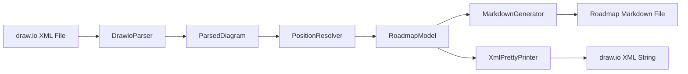

# Design Document: DrawIO to Roadmap Markdown

## Overview

This feature extends the existing `DrawioToMarkdown` CLI tool to support the full roadmap format used by `MarkdownToDrawio`. The current tool extracts activity nodes and dependency edges from draw.io XML and produces simple dependency documentation. The new feature adds:

1. **Swimlane parsing** — identify category swimlanes by style attribute and extract bounding geometry
2. **Quarter column parsing** — identify quarter column labels by id prefix and extract x-position/width
3. **Position resolution** — assign each activity to a category and quarter based on geometric position
4. **Extended Markdown generation** — produce output with `### Quarter` and `### Category` sub-sections in the exact format consumed by `MarkdownToDrawio`'s `MarkdownParser`
5. **Round-trip support** — XML pretty-printer that produces draw.io XML parseable back to an equivalent `RoadmapModel`

The goal is a complete round-trip workflow: `MarkdownToDrawio` generates a diagram → user edits in draw.io → `DrawioToMarkdown` regenerates the markdown → the cycle can repeat.

## Architecture



The pipeline is:
1. **CLI** validates arguments, reads file, orchestrates pipeline
2. **DrawioParser** parses XML into `ParsedDiagram` (nodes with geometry, swimlanes, quarter columns, edges)
3. **PositionResolver** takes `ParsedDiagram` and produces a `RoadmapModel` by assigning each activity a category and quarter based on geometric containment
4. **MarkdownGenerator** serializes `RoadmapModel` to markdown in the exact format expected by `MarkdownToDrawio`'s parser
5. **XmlPrettyPrinter** serializes `RoadmapModel` back to draw.io XML for round-trip testing

### Design Decision: Reuse vs Extend Existing Classes

The existing `DrawioParser`, `GraphBuilder`, `MarkdownGenerator`, and `XmlPrettyPrinter` were designed for the simpler dependency-only format. Rather than modifying them (which would break the existing spec), the new feature will:

- **Extend `DrawioParser`** to additionally extract swimlanes and quarter columns alongside existing node/edge extraction. The `ParsedDiagram` record will gain new fields.
- **Introduce `PositionResolver`** as a new component (no existing equivalent).
- **Replace `MarkdownGenerator`** with a new implementation that outputs the full roadmap format (Depends on + Quarter + Category sections).
- **Replace `XmlPrettyPrinter`** with a new implementation that produces swimlane/quarter-aware XML.
- **Replace `DependencyGraph`/`GraphBuilder`** with direct use of a `RoadmapModel` (the position resolver outputs the final model directly).

### Design Decision: Internal Model

The feature introduces its own `RoadmapModel` (mirroring `MarkdownToDrawio.Model.RoadmapModel`) within the `DrawioToMarkdown` project. This avoids a project reference cycle and keeps the two tools independently deployable. The models are structurally equivalent, enabling round-trip correctness validation in tests (which can reference both projects).

## Components and Interfaces

### ParsedDiagram (Extended)

```csharp
namespace DrawioToMarkdown.Parsing;

public sealed record SwimlaneDef(string Id, string Label, double X, double Y, double Width, double Height);
public sealed record QuarterColumnDef(string Id, string Label, double X, double Width);
public sealed record ActivityNodeDef(string Id, string Label, double X, double Y, double Width, double Height);
public sealed record DependencyEdgeDef(string SourceId, string TargetId);

public sealed record ParsedDiagram(
    IReadOnlyList<SwimlaneDef> Swimlanes,
    IReadOnlyList<QuarterColumnDef> QuarterColumns,
    IReadOnlyList<ActivityNodeDef> ActivityNodes,
    IReadOnlyList<DependencyEdgeDef> Edges
);
```

### IDrawioParser (Updated)

```csharp
namespace DrawioToMarkdown.Parsing;

public interface IDrawioParser
{
    ParsedDiagram Parse(string xmlContent);
}
```

### IPositionResolver (New)

```csharp
namespace DrawioToMarkdown.Resolution;

public interface IPositionResolver
{
    RoadmapModel Resolve(ParsedDiagram diagram);
}
```

### RoadmapModel (DrawioToMarkdown's own)

```csharp
namespace DrawioToMarkdown.Model;

public sealed record RoadmapActivity(
    string Label,
    string Quarter,
    string Category,
    IReadOnlyList<string> DependencyLabels
);

public sealed record RoadmapModel(
    IReadOnlyList<RoadmapActivity> Activities
);
```

### IMarkdownGenerator (Updated)

```csharp
namespace DrawioToMarkdown.Output;

public interface IMarkdownGenerator
{
    string Generate(RoadmapModel model);
}
```

### IXmlPrettyPrinter (Updated)

```csharp
namespace DrawioToMarkdown.Output;

public interface IXmlPrettyPrinter
{
    string Print(RoadmapModel model);
}
```

## Data Models

### Element Identification Rules

| Element | Identification Criteria |
|---------|------------------------|
| Swimlane | `vertex="1"` AND style contains `shape=swimlane;horizontal=0` |
| Quarter Column Label | `vertex="1"` AND id starts with `qlabel_` |
| Quarter Separator | `vertex="1"` AND id starts with `qsep_` (used only for layout reference) |
| Activity Node | `vertex="1"` AND style contains `rounded=1;whiteSpace=wrap;html=1` |
| Dependency Edge | `edge="1"` AND has `source` AND `target` attributes |

### Position Resolution Algorithm

For each `ActivityNodeDef`:
1. Compute `verticalCenter = Y + Height / 2`
2. Compute `horizontalCenter = X + Width / 2`
3. **Category assignment:**
   - Find all swimlanes where `verticalCenter` is within `[swimlane.Y, swimlane.Y + swimlane.Height]`
   - If exactly one: assign its label
   - If zero or multiple: assign the swimlane whose vertical midpoint (`Y + Height/2`) is closest to `verticalCenter`, breaking ties by document order (first in list)
4. **Quarter assignment:**
   - Find all quarter columns where `horizontalCenter` is within `[column.X, column.X + column.Width]`
   - If exactly one: assign its label
   - If zero or multiple: assign the column whose horizontal midpoint (`X + Width/2`) is closest to `horizontalCenter`, breaking ties by document order (first in list)

### Dependency Resolution Rules

- Only edges where both source and target are recognized activity node IDs are kept
- Self-referencing edges (source == target) are discarded
- Duplicate edges (same source→target pair) are deduplicated
- Activities with duplicate labels are merged: their dependency sets are unioned

### Markdown Output Format

```markdown
# Dependency Documentation

## Activity Label

### Depends on

- [Antecedent 1](#antecedent-1)
- [Antecedent 2](#antecedent-2)

### Quarter

Q1 2025

### Category

Infrastructure

```

- Activities sorted lexicographically by label (ordinal comparison)
- Dependencies sorted lexicographically by antecedent label (ordinal comparison)
- Anchor derived by: lowercase → remove non-`[a-z0-9\s-]` → replace whitespace runs with `-`
- Activities with no dependencies show "No dependencies" instead of bullet list

## Correctness Properties

*A property is a characteristic or behavior that should hold true across all valid executions of a system — essentially, a formal statement about what the system should do. Properties serve as the bridge between human-readable specifications and machine-verifiable correctness guarantees.*

### Property 1: Position resolver assigns correct category

*For any* set of non-overlapping swimlanes and any activity node whose vertical center falls within exactly one swimlane's y-range, the position resolver SHALL assign that swimlane's category label to the activity. *For any* activity node whose vertical center falls outside all swimlanes or within multiple overlapping swimlanes, the position resolver SHALL assign the swimlane whose vertical midpoint is closest to the node's vertical center.

**Validates: Requirements 2.1, 2.3, 2.5**

### Property 2: Position resolver assigns correct quarter

*For any* set of non-overlapping quarter columns and any activity node whose horizontal center falls within exactly one column's x-range, the position resolver SHALL assign that column's quarter label to the activity. *For any* activity node whose horizontal center falls outside all columns or within multiple overlapping columns, the position resolver SHALL assign the column whose horizontal midpoint is closest to the node's horizontal center.

**Validates: Requirements 2.2, 2.4, 2.6**

### Property 3: XML round-trip preserves model

*For any* valid `RoadmapModel` containing 1–500 activities with non-empty labels, quarters, categories, and 0–50 dependency labels each, printing the model to draw.io XML via the `XmlPrettyPrinter` and then parsing that XML back via the `DrawioParser` and `PositionResolver` SHALL produce a `RoadmapModel` with the same set of activity labels (case-sensitive), the same category per activity, the same quarter per activity, and the same dependency label sets per activity.

**Validates: Requirements 6.1, 1.2, 1.3, 1.4, 1.5, 3.1, 3.3, 3.4**

### Property 4: Markdown round-trip preserves model

*For any* valid `RoadmapModel` containing 1–500 activities where each activity has a non-empty label of at most 200 characters, a non-empty quarter, a non-empty category, and 0–50 dependency labels, generating markdown via the `MarkdownGenerator` and then parsing that markdown with `MarkdownToDrawio`'s `MarkdownParser` SHALL yield a model with the same activity labels, quarter values, category values, and dependency label sets.

**Validates: Requirements 6.4, 4.2, 4.3, 4.4, 4.6, 4.7**

### Property 5: Full pipeline round-trip

*For any* valid `RoadmapModel`, generating draw.io XML via `MarkdownToDrawio`'s `DiagramGenerator`, parsing that XML with our `DrawioParser` and `PositionResolver`, then generating markdown and parsing it with `MarkdownToDrawio`'s `MarkdownParser` SHALL yield a model equivalent on activity labels (case-sensitive), quarter values (case-insensitive), category values (case-insensitive), and dependency sets (unordered, case-insensitive).

**Validates: Requirements 6.2**

### Property 6: Markdown output byte-for-byte compatibility

*For any* valid `RoadmapModel`, the markdown produced by our `MarkdownGenerator` SHALL be byte-for-byte identical to the output that `MarkdownToDrawio`'s markdown pretty-printer would produce for the same model (same labels, quarters, categories, dependency sets).

**Validates: Requirements 6.3**

### Property 7: Duplicate label merging

*For any* draw.io XML containing two or more activity nodes with the same label (after whitespace normalization), the parser SHALL produce a single activity entry for that label with the dependency set being the union of all individual nodes' dependency sets.

**Validates: Requirements 6.5**

## Error Handling

| Condition | Behavior | Exit Code |
|-----------|----------|-----------|
| Input file not found | Print "Error: File not found: {path}" to stderr | 1 |
| Malformed XML | Print "Error: Malformed XML in file: {path}" to stderr | 1 |
| Missing mxfile/diagram/mxGraphModel/root structure | Print "Error: Not a recognized draw.io diagram: {path}" to stderr | 1 |
| No swimlanes detected | Print "Error: No category swimlanes detected in: {path}" to stderr | 1 |
| No quarter columns detected | Print "Error: No quarter columns detected in: {path}" to stderr | 1 |
| Activity with null/empty quarter after resolution | Print "Error: Activity \"{label}\" has no resolved quarter" to stderr; produce no output | 1 |
| Activity with null/empty category after resolution | Print "Error: Activity \"{label}\" has no resolved category" to stderr; produce no output | 1 |
| Output directory does not exist | Print "Error: Output directory not found: {dir}" to stderr | 1 |
| Permission error writing output | Print "Error: Cannot write to file: {path}" to stderr | 1 |
| Success | Write output file | 0 |

All error messages are written to standard error. On any error, no output file is produced (or partially written file is cleaned up).

## Testing Strategy

### Property-Based Tests (FsCheck.Xunit)

The project already uses **FsCheck 3.1.0** with **xUnit** for property-based testing. Each correctness property above maps to one or more property-based test methods.

**Configuration:**
- Minimum 100 iterations per property test (FsCheck default of 100 is acceptable)
- Tag format in comments: `// Feature: drawio-to-roadmap-markdown, Property {N}: {title}`

**Generators needed:**
- `RoadmapModel` generator: random valid models with 1–500 activities, non-empty labels (alphanumeric + spaces, 1–200 chars), quarters in "Q{1-4} {2020-2030}" format, categories from a random pool, and 0–50 dependency labels (referencing other activity labels in the model)
- `SwimlaneDef` generator: non-overlapping vertical bands
- `QuarterColumnDef` generator: non-overlapping horizontal bands
- `ActivityNodeDef` generator: positioned within or near generated swimlanes/columns
- Edge generators including dangling edges, self-references, and duplicates

**Test project:** `tests/DrawioToMarkdown.Tests` (already exists with FsCheck.Xunit reference)

### Unit Tests (xUnit)

Example-based and edge-case tests for:
- CLI argument handling (help flag, missing input, missing output dir, permission errors)
- Specific error messages for each error condition
- HTML stripping and entity decoding edge cases
- Anchor generation for special characters
- No-dependencies formatting

### Integration Tests

- End-to-end CLI execution with sample draw.io files produced by `MarkdownToDrawio`
- Verify exit codes and output file contents

### Test Dependencies

The test project will need a project reference to `MarkdownToDrawio` for round-trip validation (Properties 4, 5, 6). This is a test-only dependency — the production `DrawioToMarkdown` project does NOT reference `MarkdownToDrawio`.

```xml
<!-- In DrawioToMarkdown.Tests.csproj -->
<ProjectReference Include="../../src/MarkdownToDrawio/MarkdownToDrawio.csproj" />
```
