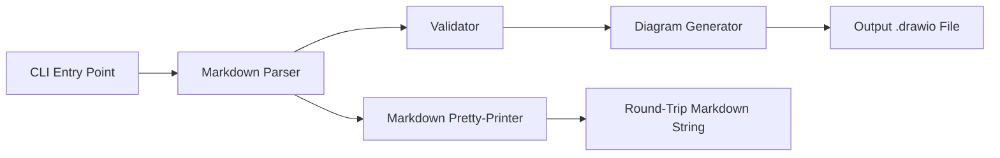

# Design Document: markdown-to-drawio

## Overview

This tool is a .NET 10 console application that converts Markdown roadmap documentation (produced by the existing drawio-to-markdown tool, augmented with Quarter and Category metadata) back into Draw.IO XML diagram files. The output features horizontal swimlanes (one per category) and vertical quarter columns, with activity nodes placed at the intersection of their assigned category row and quarter column. Dependency arrows connect activities to indicate prerequisite relationships.

The architecture mirrors the existing drawio-to-markdown tool's pipeline pattern: **Parse Markdown → Build Roadmap Model → Generate Draw.IO XML**. A secondary pretty-printer path enables round-trip testing by converting the internal model back to Markdown.

### Key Design Decisions

| Decision | Rationale |
|----------|-----------|
| `System.Xml.Linq` for XML generation | Consistent with existing project; built-in, no external dependency needed |
| `System.CommandLine` for CLI | Same library as the existing tool; consistent developer experience |
| Immutable record types for domain models | Thread-safe, testable, value-equality for round-trip verification |
| Pipeline architecture | Mirrors existing tool; clear separation of concerns, independently testable stages |
| `RoadmapModel` as richer domain model | Extends beyond `DependencyGraph` to capture Quarter/Category metadata needed for layout |
| Aggregate validation errors before exit | Better UX: user fixes all issues in one pass rather than iterating on each error |
| Separate project in same solution | Independent deployment; shared solution for development convenience |

## Architecture



### Pipeline Stages

1. **CLI** — Parses command-line arguments, validates file paths, orchestrates the pipeline
2. **Markdown Parser** — Reads Markdown text, extracts activities with their metadata (quarter, category, dependencies) into a `RoadmapModel`
3. **Validator** — Checks all activities have Quarter and Category, resolves dependency references, collects all errors
4. **Diagram Generator** — Transforms the validated `RoadmapModel` into Draw.IO-compatible XML with swimlanes and quarter columns
5. **Markdown Pretty-Printer** — Transforms a `RoadmapModel` back into canonical Markdown (for round-trip testing)

## Components and Interfaces

### Project Structure

```
src/MarkdownToDrawio/
├── MarkdownToDrawio.csproj
├── Program.cs                          # Entry point, CLI wiring
├── Cli/
│   └── CliConfiguration.cs             # System.CommandLine setup
├── Parsing/
│   ├── IMarkdownParser.cs              # Interface
│   ├── MarkdownParser.cs               # Markdown → RoadmapModel
│   └── MarkdownPrettyPrinter.cs        # RoadmapModel → Markdown string
├── Validation/
│   ├── IValidator.cs                   # Interface
│   ├── RoadmapValidator.cs             # Validates completeness of metadata
│   └── ValidationError.cs             # Error representation
├── Model/
│   ├── RoadmapModel.cs                 # Core domain model
│   └── Activity.cs                     # Activity record with metadata
└── Output/
    ├── IDiagramGenerator.cs            # Interface
    └── DiagramGenerator.cs             # RoadmapModel → Draw.IO XML
```

### Interface Definitions

```csharp
/// Parses Markdown text into a RoadmapModel.
public interface IMarkdownParser
{
    RoadmapModel Parse(string markdownContent);
}

/// Validates a RoadmapModel for completeness and consistency.
public interface IValidator
{
    IReadOnlyList<ValidationError> Validate(RoadmapModel model);
}

/// Generates Draw.IO XML from a validated RoadmapModel.
public interface IDiagramGenerator
{
    string Generate(RoadmapModel model);
}
```

### Component Responsibilities

**MarkdownParser**
- Reads Markdown line by line
- Identifies level-2 headings (`## `) as activity boundaries
- Within each activity section, extracts level-3 sub-headings:
  - `### Depends on` — followed by bullet links `- [Label](#anchor)` or "No dependencies"
  - `### Quarter` — followed by a text line (e.g., "Q1 2025")
  - `### Category` — followed by a text line (e.g., "Infrastructure")
- Returns a `RoadmapModel` with partially-populated activities (may have null quarter/category at this stage)

**RoadmapValidator**
- Iterates all activities and collects errors:
  - Missing Quarter heading → error naming the activity
  - Missing Category heading → error naming the activity
  - Empty/whitespace Quarter value → error naming the activity
  - Empty/whitespace Category value → error naming the activity
  - Unresolved dependency reference → error naming both the referring activity and the missing target
- Returns all errors as a list (does not short-circuit)

**DiagramGenerator**
- Computes layout grid: categories (sorted alphabetically) as rows, quarters (sorted by year then quarter number) as columns
- Creates mxGraphModel XML structure with:
  - Standard root cells (id="0", id="1")
  - One swimlane per category (horizontal band, label rotated 90° CCW)
  - Vertical separator lines for quarter columns
  - Quarter labels at the top
  - Activity nodes placed at the intersection of their category swimlane and quarter column
  - Vertical stacking for multiple activities in the same cell
  - Directed edges for dependencies (arrow points to dependent, tail at antecedent)
- Handles unparseable quarter values by placing them after valid quarters, sorted alphabetically

**MarkdownPrettyPrinter**
- Produces canonical Markdown from a `RoadmapModel`:
  - `# Dependency Documentation` heading
  - Activities sorted lexicographically by label
  - Sub-sections in order: `### Depends on`, `### Quarter`, `### Category`
  - Dependencies as bullet links sorted lexicographically, or "No dependencies" text
- Designed so that `Parse(Print(model))` reproduces the same model

## Data Models

```csharp
/// A single activity with its metadata extracted from Markdown.
public sealed record Activity(
    string Label,
    string? Quarter,
    string? Category,
    IReadOnlyList<string> DependencyLabels
);

/// The complete roadmap model containing all activities and their relationships.
public sealed record RoadmapModel(
    IReadOnlyList<Activity> Activities
);

/// A validation error with contextual information.
public sealed record ValidationError(
    string ActivityLabel,
    string Message
);
```

### Quarter Sorting Logic

Quarter values in "Q{n} {year}" format are sorted by:
1. Year ascending (numeric)
2. Quarter number ascending (1–4)

Unparseable quarter values are placed after all valid quarters, sorted alphabetically among themselves.

```csharp
/// Parsed quarter for sorting purposes.
public sealed record ParsedQuarter(int Year, int QuarterNumber) : IComparable<ParsedQuarter>
{
    public int CompareTo(ParsedQuarter? other)
    {
        if (other is null) return 1;
        var yearCmp = Year.CompareTo(other.Year);
        return yearCmp != 0 ? yearCmp : QuarterNumber.CompareTo(other.QuarterNumber);
    }
}
```

### Markdown Input Format (Reference)

The tool expects Markdown in this structure:

```markdown
# Dependency Documentation

## Activity Label

### Depends on

- [Antecedent Activity](#antecedent-activity)

### Quarter

Q1 2025

### Category

Infrastructure
```

### Draw.IO Output Format (Reference)

The generated XML uses the standard mxGraphModel format with swimlanes:

```xml
<mxfile>
  <diagram name="Page-1">
    <mxGraphModel>
      <root>
        <mxCell id="0" />
        <mxCell id="1" parent="0" />
        <!-- Swimlane for a category -->
        <mxCell id="cat_Infrastructure" value="Infrastructure"
                style="shape=swimlane;horizontal=0;startSize=30;..."
                vertex="1" parent="1">
          <mxGeometry x="0" y="100" width="800" height="200" as="geometry" />
        </mxCell>
        <!-- Activity node within the swimlane -->
        <mxCell id="act_0" value="Design API"
                style="rounded=1;whiteSpace=wrap;..."
                vertex="1" parent="cat_Infrastructure">
          <mxGeometry x="50" y="20" width="120" height="40" as="geometry" />
        </mxCell>
        <!-- Dependency edge -->
        <mxCell id="edge_0" edge="1" source="act_1" target="act_0" parent="1" />
      </root>
    </mxGraphModel>
  </diagram>
</mxfile>
```

## Correctness Properties

*A property is a characteristic or behavior that should hold true across all valid executions of a system — essentially, a formal statement about what the system should do. Properties serve as the bridge between human-readable specifications and machine-verifiable correctness guarantees.*

### Property 1: Parse/Print Round-Trip

*For any* valid `RoadmapModel` (containing activities with non-empty labels, non-empty quarter values, non-empty category values, and dependency labels that reference only existing activity labels), pretty-printing the model to Markdown and then parsing that Markdown back into a `RoadmapModel` SHALL produce a model equivalent to the original (same set of activity labels, same quarter assignments, same category assignments, and same dependency relationships).

**Validates: Requirements 1.1, 1.2, 1.3, 1.4, 1.5, 1.6, 5.1, 5.2, 5.3, 5.4, 5.5**

### Property 2: Validation Detects All Metadata Errors

*For any* `RoadmapModel` where a known subset of activities have missing or whitespace-only Quarter values and/or missing or whitespace-only Category values, the validator SHALL return an error for every such activity, and the total number of metadata errors SHALL equal the number of activities with invalid metadata fields.

**Validates: Requirements 2.1, 2.2, 2.3, 2.4, 2.6**

### Property 3: Validation Detects All Unresolved Dependencies

*For any* `RoadmapModel` where some activities contain dependency labels that do not match any activity label in the model, the validator SHALL return an error for each unresolved dependency reference, and each error SHALL identify both the activity containing the reference and the unresolved target label.

**Validates: Requirements 2.5, 2.6**

### Property 4: Generated XML Is Valid

*For any* valid `RoadmapModel` (all activities have non-empty quarter, category, and labels; all dependency labels resolve to existing activities), the Diagram Generator SHALL produce a string that is parseable as valid XML by `XDocument.Parse()` without throwing an exception.

**Validates: Requirements 3.1, 3.9**

### Property 5: Swimlane Structure Matches Categories

*For any* valid `RoadmapModel`, the generated Draw.IO XML SHALL contain exactly one swimlane element for each distinct category in the model, each swimlane SHALL have a `value` attribute matching its category label, each swimlane SHALL have a style containing `horizontal=0` (indicating vertical text), and swimlanes SHALL be ordered top-to-bottom alphabetically by category label (verified by ascending y-coordinate values).

**Validates: Requirements 3.2, 3.3**

### Property 6: Quarter Column Ordering

*For any* valid `RoadmapModel` containing quarter values, the generated Draw.IO XML SHALL position quarter columns left-to-right such that all quarters matching the "Q{n} {year}" format appear sorted by year ascending then quarter number ascending, and any quarter values not matching that format appear after all valid quarters, sorted alphabetically among themselves.

**Validates: Requirements 3.4, 3.5, 3.6, 3.10**

### Property 7: Activity Placement Correctness

*For any* valid `RoadmapModel`, the generated Draw.IO XML SHALL place each activity node within the swimlane corresponding to its category and at the x-position corresponding to its quarter column, and when multiple activities share the same category and quarter, they SHALL have distinct y-coordinates within that cell (no overlapping).

**Validates: Requirements 3.7**

### Property 8: Dependency Edges Match Model

*For any* valid `RoadmapModel` with dependency relationships, the generated Draw.IO XML SHALL contain a directed edge for each dependency, where the `source` attribute references the antecedent activity's element ID and the `target` attribute references the dependent activity's element ID.

**Validates: Requirements 3.8**

### Property 9: Default Output Path Derivation

*For any* valid file path string with any extension, the default output path computation SHALL produce a path identical to the input path except with the extension replaced by `.drawio`.

**Validates: Requirements 4.3**

## Error Handling

| Scenario | Behavior | Exit Code |
|----------|----------|-----------|
| Input file not found | Print to stderr: `Error: File not found: {path}` | 1 |
| No level-2 headings found | Print to stderr: `Error: No activities found in: {path}` | 1 |
| Activity missing Quarter | Print to stderr: `Error: Activity "{label}" is missing a Quarter` | 1 |
| Activity missing Category | Print to stderr: `Error: Activity "{label}" is missing a Category` | 1 |
| Activity has empty Quarter | Print to stderr: `Error: Activity "{label}" has an empty Quarter value` | 1 |
| Activity has empty Category | Print to stderr: `Error: Activity "{label}" has an empty Category value` | 1 |
| Unresolved dependency | Print to stderr: `Error: Activity "{label}" depends on "{target}" which does not exist` | 1 |
| Output directory not found | Print to stderr: `Error: Output directory not found: {dir}` | 1 |
| Permission error on output | Print to stderr: `Error: Cannot write to file: {path}` | 1 |
| Help flag or no arguments | Print usage text to stdout | 0 |
| Multiple validation errors | Print ALL errors (one per line) before exiting | 1 |

### Error Strategy

- Validation errors are collected into a list and reported all at once (aggregate pattern)
- File I/O errors are caught at the CLI layer and converted to user-friendly messages
- All user-facing error messages go to `stderr`; help/usage goes to `stdout`
- Non-zero exit codes for all error conditions enable script integration
- The validator returns a `IReadOnlyList<ValidationError>` — the CLI layer decides whether to exit or continue

## Testing Strategy

### Dual Testing Approach

**Unit Tests (xUnit)**
- Specific examples: known Markdown files produce expected RoadmapModels and Draw.IO XML
- Edge cases: empty files, files with no headings, activities with zero dependencies, single activity
- Error conditions: file not found, missing metadata, unresolved dependencies, invalid output directory
- CLI argument parsing: help flag, missing args, default output path

**Property-Based Tests (FsCheck.Xunit)**
- Library: [FsCheck.Xunit](https://www.nuget.org/packages/FsCheck.Xunit/) version 3.1.0 — same version as the existing test project
- Minimum 100 iterations per property test
- Each property test references its design document property via tag comment
- Tag format: `// Feature: markdown-to-drawio, Property {N}: {title}`

**Property Test Configuration:**
- Generator for `RoadmapModel`: random activity count (1–20), random alphanumeric labels (unique), random quarter values in "Q{n} {year}" format, random category strings, random valid dependency references
- Generator for invalid `RoadmapModel`: same but with some activities missing quarter/category or having whitespace-only values, and some dependency labels referencing non-existent activities
- Generator for file paths: random valid path strings with various extensions
- Each property-based test MUST run a minimum of 100 iterations

### Test Project Structure

```
tests/MarkdownToDrawio.Tests/
├── MarkdownToDrawio.Tests.csproj
├── Parsing/
│   ├── MarkdownParserTests.cs              # Unit tests for parser
│   └── RoundTripPropertyTests.cs           # Property 1
├── Validation/
│   ├── RoadmapValidatorTests.cs            # Unit tests for validator
│   ├── MetadataValidationPropertyTests.cs  # Property 2
│   └── DependencyValidationPropertyTests.cs # Property 3
├── Output/
│   ├── DiagramGeneratorTests.cs            # Unit tests for diagram output
│   ├── XmlValidityPropertyTests.cs         # Property 4
│   ├── SwimlanePropertyTests.cs            # Property 5
│   ├── QuarterOrderingPropertyTests.cs     # Property 6
│   ├── PlacementPropertyTests.cs           # Property 7
│   └── EdgePropertyTests.cs               # Property 8
├── Cli/
│   ├── CliTests.cs                         # Unit tests for CLI behavior
│   └── OutputPathPropertyTests.cs          # Property 9
└── Generators/
    └── ArbitraryRoadmaps.cs                # FsCheck generators for domain types
```

### Dependencies

| Package | Version | Purpose |
|---------|---------|---------|
| `System.CommandLine` | 2.0.0-beta4.22272.1 | CLI argument parsing (same version as existing project) |
| `FsCheck.Xunit` | 3.1.0 | Property-based testing (same version as existing tests) |
| `xunit` | 2.9.3 | Unit test framework (same version as existing tests) |
| `Microsoft.NET.Test.Sdk` | 17.13.0 | Test runner (same version as existing tests) |
| `xunit.runner.visualstudio` | 2.8.2 | VS test adapter (same version as existing tests) |

